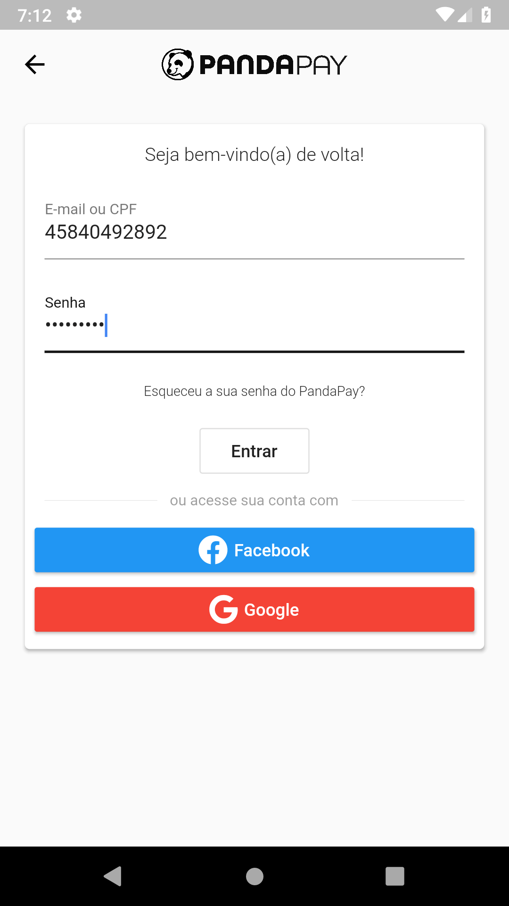
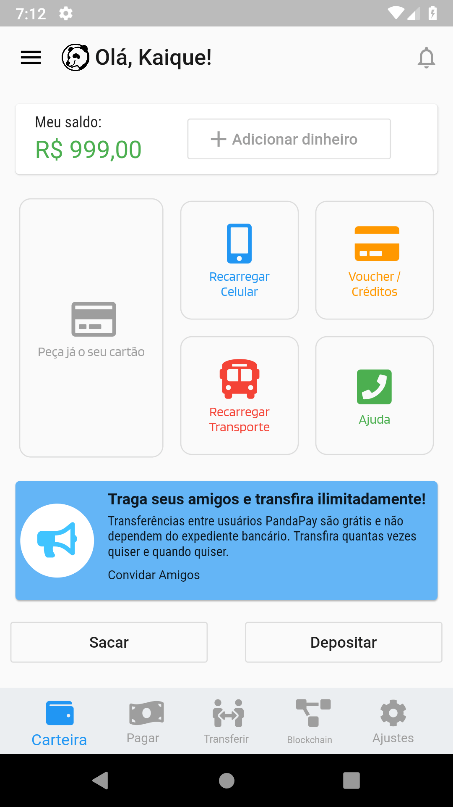

# Desafio PandaPay - Flutter Developer Test

> Desenvolver: Splash Screen + Tela de 1º acesso + tela de cadastro + Tela inicial de área logada  
> Utilizar a linguagem Dart/Flutter e gerar uma APK ao final.

*PandaPay* **challange** made with:

 [Dart](https://dart.dev) & [Flutter](https://flutter.dev)

**Dependencies:**

-   [cupertino_icons](https://pub.dev/packages/cupertino_icons): ^0.1.3
-   [mobx](https://pub.dev/packages/mobx): ^1.1.1
-   [flutter_mobx](https://pub.dev/packages/flutter_mobx): ^1.1.0
-   [google_fonts](https://pub.dev/packages/google_fonts): ^0.3.10
-   [shimmer](https://pub.dev/packages/shimmer): ^1.1.0
-   [intro_slider](https://pub.dev/packages/intro_slider): ^2.2.9
-   [flutter_form_builder](https://pub.dev/packages/flutter_form_builder): ^3.8.2
-   [intl](https://pub.dev/packages/intl): ^0.16.1
-   [country_code_picker](https://pub.dev/packages/country_code_picker): ^1.3.9
-   [mask_text_input_formatter](https://pub.dev/packages/mask_text_input_formatter): ^1.0.6
-   [font_awesome_flutter](https://pub.dev/packages/font_awesome_flutter): ^8.8.1
-   [flash](https://pub.dev/packages/flash): ^1.2.3
-   [firebase_auth](https://pub.dev/packages/firebase_auth): ^0.15.5+3
-   [cloud_firestore](https://pub.dev/packages/cloud_firestore): ^0.13.4+2
-   [progress_dialog](https://pub.dev/packages/progress_dialog): ^1.2.1
-   [persistent_bottom_nav_bar](https://pub.dev/packages/persistent_bottom_nav_bar): ^1.2.1
-   [flutter_advanced_networkimage](https://pub.dev/packages/flutter_advanced_networkimage): ^0.7.0

**Dev Dependencies:**

-   [mobx_codegen](https://pub.dev/packages/mobx_codegen): ^1.0.3
-   [build_runner](https://pub.dev/packages/build_runner): ^1.8.1
-   [flutter_launcher_icons](https://pub.dev/packages/flutter_launcher_icons): ^0.7.4

## Screenshots

## Test accounts

| E-mail                        | Password  |
|:------------------------------|:----------|
| teste@teste.com               | 123456789 |
| kaique.gazola@fatec.sp.gov.br | 123456789 |

## Test Mobile Phones

| Phone number              | Code   |
|:--------------------------|:-------|
| +55 17 98976-5514         | 456789 |
| +55 11 3696-4091          | 123456 |
